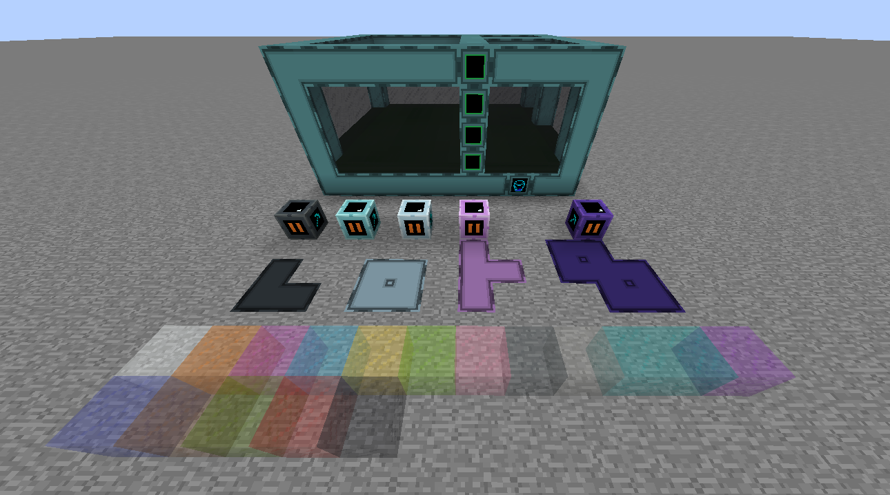

# IC2-Additions *(tentative title)*
A small modification that adds items that improve the convenience of the game.

## Roadmap
- [x] Miner (has 5 tier). Working regardless of the update. *(Skyline918)*
- [x] Connectable casings and borderless glass. *(S1pepega)*
- [x] Customizable multiblock tanker (has 5 tier) with bus. *(S1pepega)*
- [ ] Gas collector. *(Skyline918)*
- [ ] Liquid pump. *(?)*
- [ ] Recipes. *(?)*

> [!CAUTION]
> 
> Any version of IC2 (classic or experiment) is required for full operation. 
> But the mod can be launched without this modification.

### Miner:
TODO

### Multiblock tanker:
TODO

### Gas collector:
TODO